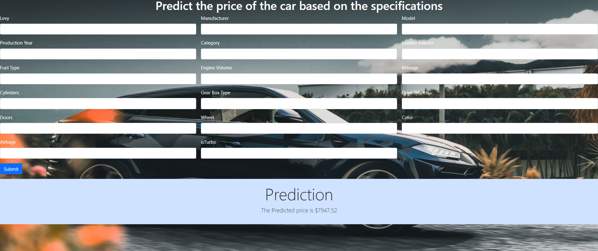

## End to End Machine Learning Project

  This project was actually a hackathon organized by Math Company on Machine    Hack's website.
  Link to Hackathon - https://machinehack.com/hackathons/data_hack_mathcothon_car_price_prediction_challenge/overview
  
## I have followed all the machine learning lifecycle such as:
a. Gathering Data
b. Data preparation
c. Data Wrangling
d. Data Analysis
e. Train Model
f. Test Model
g. Deployment

# After Making the Model I thought of converting it to a real world product. So I used Django as abackend to deploy my model.

# Here's How website looks like

